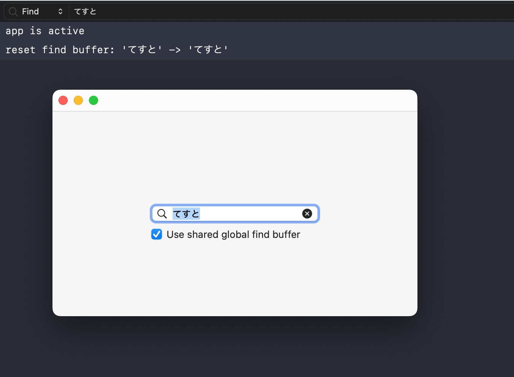

# GlobalFindKeyword
A demonstration of the global find buffer on macOS app.



The find string sharing feature is not well known on the macOS platform today. Familiar examples include the search fields in Xcode and Safari. Some users see it as a bug, but it’s an intentionally designed feature that has existed since older Mac OS X (or NeXTSTEP).

This project is a small code that uses NSPasteboard to work with the global find buffer on macOS. This provides a traditional find experience.


## Read and write with NSPasteboardNameFind

```swift
// Get the find string from the global find buffer.
let findPBoard = NSPasteboard(name: .find)
let findString = findPBoard.string(forType: .string)

// Set the find string to the global find buffer.
let findString = "hello"
let findPBoard = NSPasteboard(name: .find)
findPBoard.clearContents()
findPBoard.setString(findString, forType: .string)
```

## References

`NSPasteboardNameFind` (ObjC) or `NSPasteboard.Name.find` (Swift). The previous API was `NSFindPboard`.
> https://developer.apple.com/documentation/appkit/nspasteboard/name-swift.struct/find

`NSFindPboard` on OpenStepSpec (1994)
> https://www.levenez.com/NeXTSTEP/OpenStepSpec.pdf
